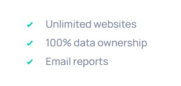
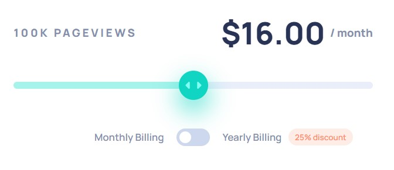

# Frontend Mentor - Interactive pricing component solution

This is a solution to the [Interactive pricing component challenge on Frontend Mentor](https://www.frontendmentor.io/challenges/interactive-pricing-component-t0m8PIyY8). Frontend Mentor challenges help you improve your coding skills by building realistic projects.

## Table of contents

- [Overview](#overview)
  - [The challenge](#the-challenge)
  - [Screenshot](#screenshot)
  - [Links](#links)
- [My process](#my-process)
  - [Built with](#built-with)
  - [What I learned](#what-i-learned)
  - [Continued development](#continued-development)
  - [Useful resources](#useful-resources)
- [Author](#author)
- [Acknowledgments](#acknowledgments)

## Overview

### The challenge

Users should be able to:

- View the optimal layout for the app depending on their device's screen size
- See hover states for all interactive elements on the page
- Use the slider and toggle to see prices for different page view numbers

### Screenshot


### Links

- Repository URL: [https://github.com/cholis04/interactive-pricing-component-main](https://github.com/cholis04/interactive-pricing-component-main)
- Live Site URL: [https://interactive-pricing-fem.web.app/](https://interactive-pricing-fem.web.app/)

## My process

### Built with

- Semantic HTML5 markup
- Desktop-first workflow
- CSS custom properties
- Flexbox & Grid - Layouting
- Input type 'Range' & 'Checkbox'
- [Typescript](https://www.typescriptlang.org/) - For Development JavaScript Compile

This is my first project using typescript.

- [Eslint](https://eslint.org/) - For evaluate patterns in code
- [Prettier](https://prettier.io/) - Formatting on Save
- [Firebase Hosting](https://firebase.google.com/) - Host Static File

### What I learned

#### List Style Image



```css
main .card-price > .action > ul {
  list-style-image: url('../images/icon-check.svg');
}
```

#### Selection Input type Range / Slider for Styling



```html
<input
  type="range"
  min="0"
  max="4"
  step="1"
  name="pageviews"
  id="pageviews"
  value="2"
/>
```

```css
input[type='range'] {
  /* Styels */
}
input[type='range']::-webkit-slider-thumb {
  /* Styels */
}
input[type='range']::-webkit-slider-thumb:hover {
  /* Styels */
}
input[type='range']::-webkit-slider-thumb:active {
  /* Styels */
}
input[type='range']::-webkit-slider-runnable-track {
  /* Styels */
}
input[type='range']::-moz-range-progress {
  /* Styels */
}
input[type='range']::-ms-fill-lower {
  /* Styels */
}
```

#### Create Toggle from Checkbox


```html
<label for="period">
  <input type="checkbox" name="period" id="period" />
  <span class="box-check">
    <span></span>
  </span>
</label>
```

```css
label > input[type='checkbox'] {
  display: none;
}
label {
  display: flex;
  align-items: center;
  justify-content: center;
  cursor: pointer;
}
label > span.box-check {
  position: relative;
  width: 46px;
  height: 24px;
  border-radius: 25px;
  display: flex;
  align-items: center;
  padding: 2px 4px;
  background-color: var(--toggle-background);
  transition: all 0.2s cubic-bezier(0.175, 0.885, 0.32, 1.275);
}

@media (hover: hover) {
  label:hover > span.box-check {
    background-color: var(--soft-cyan);
  }
}

label > span.box-check > span {
  position: absolute;
  display: block;
  width: 16px;
  height: 16px;
  border-radius: 50px;
  background-color: var(--white);
  transition: all 0.2s ease-in-out;
}

label > input[type='checkbox']:checked + span.box-check > span {
  transform: translateX(22px);
}

label > input[type='checkbox']:checked + span.box-check {
  background-color: var(--strong-cyan);
}
```

### Continued development

Input type range is still not supported in some older browsers. Mainly for applying styles that require a prefix to run well. A combination of JavaScript and CSS is indispensable

- [https://developer.mozilla.org/en-US/docs/Web/HTML/Element/input/range](https://developer.mozilla.org/en-US/docs/Web/HTML/Element/input/range) - This method is very easy to apply. but unfortunately, some old browsers don't support datalist. [https://caniuse.com/?search=datalist](https://caniuse.com/?search=datalist)

### Useful resources

- [Styling range input with CSS and JavaScript for better UX](https://nikitahl.com/style-range-input-css) - This is an amazing article which helped me finally understand about styling range input with CSS. I'd recommend it to anyone still learning this concept.

- [Input Range progress with css gradient](https://codepen.io/duplich/pen/qjYQEZ?editors=0100) - This helped me for Create Range Progress with CSS Gradient. I really liked this pattern and will use it going forward.

## Author

- Website - [https://cholis04.github.io](https://cholis04.github.io)
- Frontend Mentor - [@cholis04](https://www.frontendmentor.io/profile/cholis04)
- Dribbble - [cholis04](https://dribbble.com/cholis04)
- Instagram - [@cholis04](https://instagram.com/cholis04)
- Codepen - [cholis04](https://codepen.io/cholis04)

## Acknowledgments

Many thanks to anyone who provided feedback.
